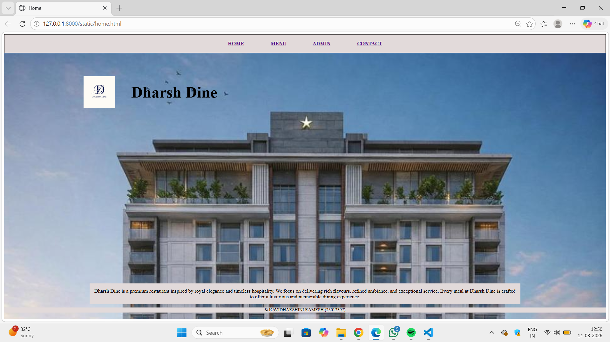
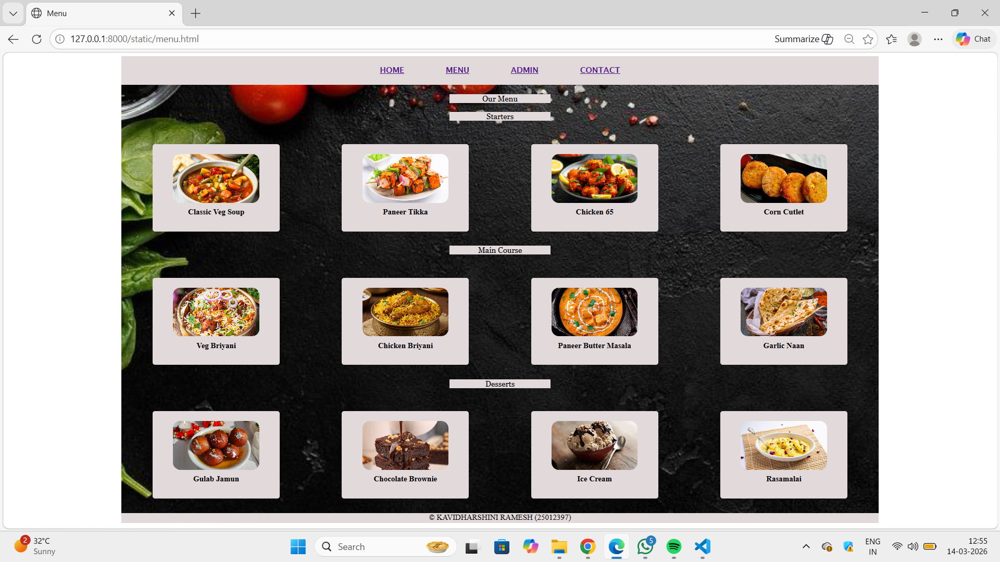
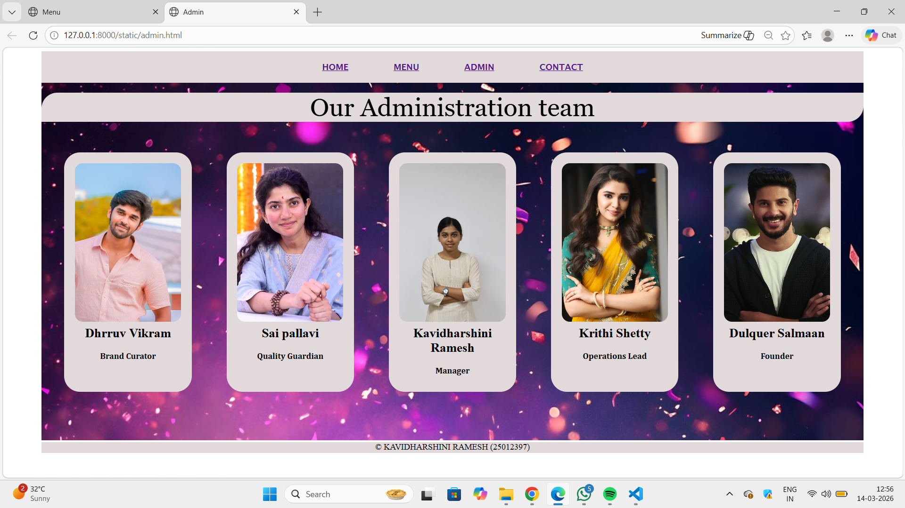
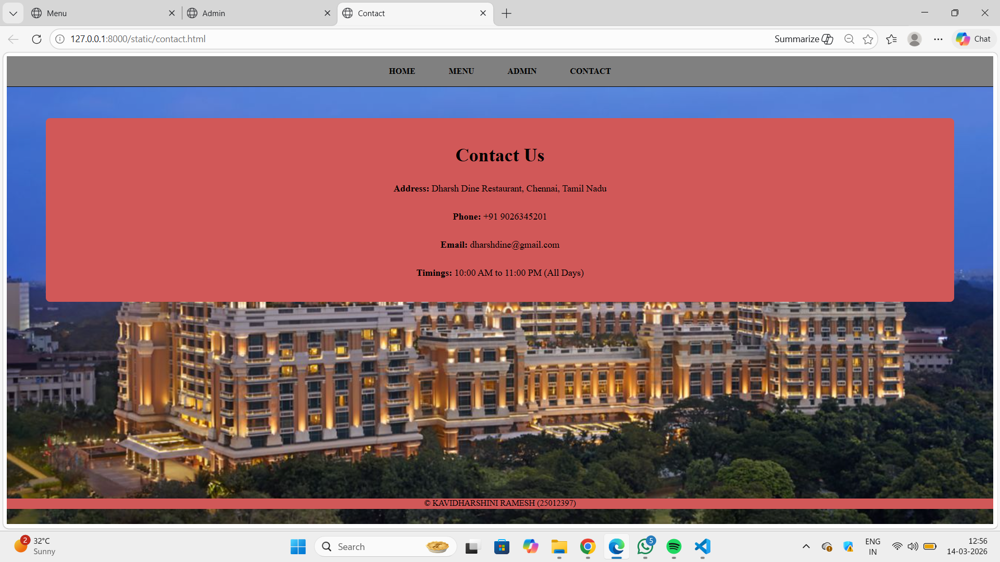

# Ex.06 Restaurant Website
## Date:14.03.2026

## AIM:
To develop a static Restaurant website to display the food items and services provided by them.

## DESIGN STEPS:

### Step 1:
Requirement collection.

### Step 2:
Creating the layout using HTML and CSS.

### Step 3:
Updating the sample content.

### Step 4:
Choose the appropriate style and color scheme.

### Step 5:
Validate the layout in various browsers.

### Step 6:
Validate the HTML code.

### Step 7:
Publish the website in Localhost.

## PROGRAM:
```
Home.html

<html>
    <head>
        <title>Home</title>
        <link rel="stylesheet" href="home.css">

    </head>
    <body>
        <div class="restbg">

    <div class="type">
        <a href="home.html">HOME</a>
        <a href="menu.html">MENU</a>
        <a href="admin.html">ADMIN</a>
        <a href="contact.html">CONTACT</a>
    </div>

    <div class="brand">
        
        <h1 class="name">Dharsh Dine</h1>
    </div>

    <div class="bottom">
        <div class="about">
            <p>
                Dharsh Dine is a premium restaurant inspired by royal elegance and timeless hospitality.
                We focus on delivering rich flavours, refined ambiance, and exceptional service.
                Every meal at Dharsh Dine is crafted to offer a luxurious and memorable dining experience.
            </p>
        </div>

        <div class="footer">
            &copy; KAVIDHARSHINI RAMESH (25012397)
        </div>
    </div>

</div>
    </body>
</html>

Home.css

.restbg{
    background-image: url("restbg\ copy.png");
    width: 100%;
    height: 100%;
    background-size: cover;
    position: relative; 
}
.type{
    padding: 20px;
    background-color: rgb(226, 218, 218);
    text-align: center;
    font-weight: bold;
    word-spacing: 80px;
    border: 1px solid black;
    text-decoration: none;
}
.brand{
    display: flex;
    align-items: center;
    margin-top: 60px;
}

.logo{
    width: 100px;
    height: 100px;
    margin-left: 250px;
}

.name{
    font-size: 50px;
    margin-left: 50px;
}
.bottom{
    position: absolute;
    bottom: 20px;      
    width: 100%;
    text-align: center;
}

.about p{
    background-color: rgb(226, 218, 218);
    color: black;
    padding: 15px;
    width: 70%;
    margin: 0 auto 10px auto;
}

.footer{
    color: black;
    font-size: 14px;
    background-color:rgb(226, 218, 218);
}

Menu.html

<html>
    <head>
        <title>Menu</title>
         <link rel="stylesheet" href="menu.css">
    </head>
    <body><center>
        <div class="restbg">
            <div class="type">
                <a href="home.html" title="HOME" target="_blank">HOME</a>
                <a href="menu.html" title="MENU" target="_blank">MENU</a>
                <a href="admin.html" title="ADMIN" target="_blank">ADMIN</a>
                <a href="contact.html" title="CONTACT" target="_blank">CONTACT</a>
            </div>
            <div class="title">Our Menu</div>
                <div class="dish">Starters</div>
                <div class="starters">
                    <div class="starter">
                    
                    <h1>Classic Veg Soup</h1>
                </div>
                <div class="starter">
                    
                    <h1>Paneer Tikka</h1>
                </div>
                <div class="starter">
                    
                    <h1>Chicken 65</h1>
                </div>
                <div class="starter">
                    
                    <h1>Corn Cutlet</h1>
                </div>

                </div>
                
                <div class="dish">Main Course</div>
                <div class="maincourse">
                    <div class="course">
                    
                    <h1>Veg Briyani</h1>
                </div>
                <div class="course">
                    
                    <h1>Chicken Briyani</h1>
                </div>
                <div class="course">
                    
                    <h1>Paneer Butter Masala</h1>
                </div>
                <div class="course">
                    
                    <h1>Garlic Naan</h1>
                </div>

                </div>
                
                <div class="dish">Desserts</div>
                <div class="desserts">
                    <div class="end">
                    
                    <h1>Gulab Jamun</h1>
                </div>
                <div class="end">
                    
                    <h1>Chocolate Brownie</h1>
                </div>
                <div class="end">
                    
                    <h1>Ice Cream</h1>
                </div>
                <div class="end">
                    
                    <h1>Rasamalai</h1>
                </div>
            </div>
            <div class="footer">
           <p>&copy; KAVIDHARSHINI RAMESH (25012397)</p>
           </div>

        </div>
    </body>
    </center>
</html>

Menu.css

.restbg{
    background-image:url("menu.bg.jpeg");
    width:1550px;
    height: 950px;
    background-size: cover;
    background-attachment: fixed;
}
.type{
    width: 1510px;
    margin-left: 0%;
    padding: 20px;
    background-color: rgb(226, 218, 218);
    text-align: center;
    font-family: 'Lucida Sans', 'Lucida Sans Regular', 'Lucida Grande', 'Lucida Sans Unicode', Geneva, Verdana, sans-serif;
    position: relative;
    font-weight: bold;
    word-spacing: 80px;
    text-decoration: none;
}
.title{
    color:black;
    background-color:  rgb(226, 218, 218);
    width: 5.5cm;
    font-family:Georgia, 'Times New Roman', Times, serif;
    text-align:center;
    position: relative;
    font: size 200px;;
    margin-top:0.5cm;
}
.dish{
    color:black;
    background-color:  rgb(226, 218, 218);
    width: 5.5cm;
    font-family:Georgia, 'Times New Roman', Times, serif;
    text-align:center;
    position: relative;
    font: size 100px;;
    margin-top:0.5cm;
}
.starters {
    display: grid ;
    grid-template-columns: repeat(auto-fit, minmax(10px, 1fr));
    gap: 20px;
    justify-items: center;
    padding: 10px;
    margin-top: 1cm;

}
.starter{
    background-color: rgb(226, 218, 218);
    grid-template-columns: repeat(auto-fit, minmax(10px, 1fr));
    border-radius: 5px;
    text-align: center;
    padding: 20px;
    width: 60%;
}
.starter img {
    border-radius: 15px;
    width: 80%;
    height: 100px;
    object-fit: cover;
}

.starter h1 {
    font-size:medium;
    color: black;
    margin-top: 10px;
}
.maincourse {
    display: grid ;
    grid-template-columns: repeat(auto-fit, minmax(10px, 1fr));
    gap: 20px;
    justify-items: center;
    padding: 10px;
    margin-top: 1cm;

}
.course{
    background-color: rgb(226, 218, 218);
    border-radius: 5px;
    text-align: center;
    padding: 20px;
    width: 60%;
}
.course img {
    border-radius: 15px;
    width: 80%;
    height: 100px;
    object-fit: cover;
}

.course h1 {
    font-size:medium;
    color: black;
    margin-top: 10px;
}
.desserts {
    display: grid ;
    grid-template-columns: repeat(auto-fit, minmax(10px, 1fr));
    gap: 20px;
    justify-items: center;
    padding: 10px;
    margin-top: 1cm;

}
.end{
    background-color: rgb(226, 218, 218);
    border-radius: 5px;
    text-align: center;
    padding: 20px;
    width: 60%;
}
.end img {
    border-radius: 15px;
    width: 80%;
    height: 100px;
    object-fit: cover;
}

.end h1 {
    font-size:medium;
    color: black;
    margin-top: 10px;
}
.footer{
    width: 1550px;
    height: 20px;
    background-color: rgb(226, 218, 218);
    text-align: center;
    margin-top:20px;
    position: relative;
    margin-bottom: 20px;
}

Admin.html

<html>
    <head>
    <title>
        Admin
    </title>
     <link rel="stylesheet" href="Admin.css">
    </head>
    
     <body><center>
        <div class="restbg">
            <div class="type">
                <a href="home.html" title="HOME" target="_blank">HOME</a>
                <a href="menu.html" title="MENU" target="_blank">MENU</a>
                <a href="admin.html" title="ADMIN" target="_blank">ADMIN</a>
                <a href="contact.html" title="CONTACT" target="_blank">CONTACT</a>
            </div>
            <div class="title">Our Administration team</div>
        <div class="grid">
            <div class="admin">
                
                <h2>Dhrruv Vikram</h2>
                <h1>Brand Curator</h1>
            </div>
            <div class="admin">
                
                <h2>Sai pallavi</h2>
                <h1>Quality Guardian</h1>
            </div>
            <div class="admin">
                
                <h2>Kavidharshini Ramesh</h2>
                <h1>Manager</h1>
            </div>
            <div class="admin">
                
                <h2>Krithi Shetty</h2>
                <h1>Operations Lead</h1>
            </div>
             <div class="admin">
                
                <h2>Dulquer Salmaan</h2>
                <h1>Founder</h1>
        </div>
         </div>
         <footer>&copy; KAVIDHARSHINI RAMESH (25012397)</footer>
        </div>

     </body>
     </center>
</html>

Admin.css

.restbg{
    background-image:url("adminbg.jpeg");
    width:1550px;
    height:735px;
    background-size: cover;
}
.type{
    width: 1510px;
    margin-left: 0%;
    padding:20px;
    background-color:rgb(226, 218, 218);
    text-align: center;
    font-family: 'Lucida Sans', 'Lucida Sans Regular', 'Lucida Grande', 'Lucida Sans Unicode', Geneva, Verdana, sans-serif;
    position: relative;
    font-weight: bold;
    word-spacing: 80px;
    text-decoration: none;
}
.title{
    color:black;
    background-color: rgb(226, 218, 218);
    width: 41cm;
    font-family:Georgia, 'Times New Roman', Times, serif;
    text-align:center;
    position: relative;
    font-size:300%;
    margin-top:0.5cm;
    border-radius: 30px 0px 30px 0px;
}
.grid {
    display: grid ;
    grid-template-columns: repeat(auto-fit, minmax(10px, 1fr));
    gap: 20px;
    justify-items: center;
    padding: 20px;
    margin-top: 1cm;

}

.admin {
    background-color:rgb(226, 218, 218);
    border-radius: 30px;
    text-align: center;
    padding: 20px;
    width: 70%;
}
.admin img {
    border-radius: 15px;
    width: 100%;
    height: 300px;
    object-fit: cover;
}
 h2{
    font-size:x-large;
    color: black;
    margin-top:0.2cm;
 }

 h1 {
    font-size:medium;
    color: black;
    margin-top: 10px;
    font-family:Cambria, Cochin, Georgia, Times, 'Times New Roman', serif;
}
p {
    color: black;
    margin-top:0.01cm;
    font-size: x-small;
}
footer{
    width: 1550px;
    height: 20px;
    background-color:rgb(226, 218, 218);
    text-align: center;
    margin-top:2cm;
    position: relative
}

Contact.html

<html>
    <head>
        <title>Contact</title>
        <link rel="stylesheet" href="contact.css">
    </head>
    <body>
        <div class="restbg">
            <div class="type">
                <a href="home.html" title="HOME" target="_blank">HOME</a>
                <a href="menu.html" title="MENU" target="_blank">MENU</a>
                <a href="admin.html" title="ADMIN" target="_blank">ADMIN</a>
                <a href="contact.html" title="CONTACT" target="_blank">CONTACT</a>
            </div>
            <div class="contact-section">
                <h2>Contact Us</h2>

                <div class="contact-details">
                <p><b>Address:</b> Dharsh Dine Restaurant, Chennai, Tamil Nadu</p>
                <p><b> Phone:</b> +91 9026345201</p>
                <p><b>Email:</b> dharshdine@gmail.com</p>
                <p><b>Timings:</b> 10:00 AM to 11:00 PM (All Days)</p>
                </div>
            </div>
            <footer>&copy; KAVIDHARSHINI RAMESH (25012397)</footer>

        </div>
    </body>
</html>

Contact.css

.restbg{
    background-image: url("itc.jpg");
    width: 100%;
    height: 100%;
    background-size: cover;
    position: relative; 
}

.type{
    background-color: gray;
    padding: 20px;
    text-align: center;
    word-spacing: 60px;
    border-bottom: 1px solid black;
}

.type a{
    text-decoration: none;
    color: black;
    font-weight: bold;
}

.contact-section{
    background-color: gray;
    width: 100%;
    margin: 60px auto;
    padding: 40px;
    text-align: center;
    border-radius: 8px;
}

.contact-section h2{
    font-size: 36px;
    margin-bottom: 25px;
}

.contact-details p{
    font-size: 18px;
    line-height: 2;
}
footer{
    width: 100%;
    height: 20px;
    background-color: gray;
    text-align: center;
    margin-top: 10cm; 
    position: relative;
}

```
## OUTPUT:





## RESULT:
The program for designing software company website using HTML and CSS is completed successfully.
